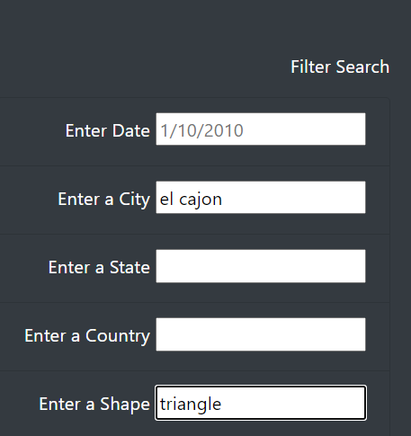

# UFOs
UofT data analytics
# OVERVIEW
Dana is a data journalist who is given an assignment to write about her home town McMinnville, Oregon.<br> McMinnville is famous for its sightings and even has an annual gathering of UFO enthusiasts. She is really excited 
about this topic as it had already caught her attention during childhood when she read about an article on Farmer TRENT sighting back in 1950. 

The only data that she has available is a java script file with siting information. She is going to use her knowledge in html and javascript to display sightings data and also make it dynamic to allow the visitor to filter data on data, city, state, country and shape.

# RESULTS:

Wedbpage walkthrough:
When users logs into the webpage, they are displayed some initial titles to grab their attention.
The large main title `The Truth is Out There` on a dark space image background stands out right at the users.
Also the main text of the webpage starts with the phrase `Are we alone in the universe?` further stimulates the users curiosity to read the text and browse more. <br>
On the dynamic side, the users are displayed a table of Ufo sitings with attributes as the figure below:<br>
<br>
Users can then choose to filter the data on the attributes as the figure below:<br>
<br>
The user is then presented with a filtered version of the data<br>
(static/images/UfoSitingsFiltered.png)


# Summary: 
In a summary statement, describe one drawback of this new design and two recommendations for further development.
The current web-site has the below limitations:<br>
1- The search is on the fields is case sensitive, this can be enhanced by filtering on upper case in `filterTable()` 
```
      switch (k) {
          case "datetime":
              filteredData = filteredData.filter(row => row.datetime === filter[k]);
              break;
          case "city":
              filteredData = filteredData.filter(row => row.city.toUpperCase() ===filter[k].toUpperCase());
              break;
          case "state":
              filteredData = filteredData.filter(row => row.state.toUpperCase() === filter[k].toUpperCase());
              break;
          case "country":
              filteredData = filteredData.filter(row => row.country.toUpperCase() ===filter[k].toUpperCase());
              break;
          case "shape":
              filteredData = filteredData.filter(row => row.shape.toUpperCase() ===filter[k].toUpperCase());
              break;
      }
```
2- To reset the filters we have to either clear the fields one by one or reload the page.<br>
We can add a clear filter button in the form<br>
`<button id="clear-form" type="button" class="btn btn-dark">Clear Form</button>`<br>
Add an event listener to this button in `app.js` to clear the filter and load the data when clicked<br>
```
function clearForm() {
    filter = {};
    filterTable();
}
d3.selectAll("#clear-form").on("click", clearForm);
```
3- For the date filters we can create a drop down list of the available dates and then use that as the date control

